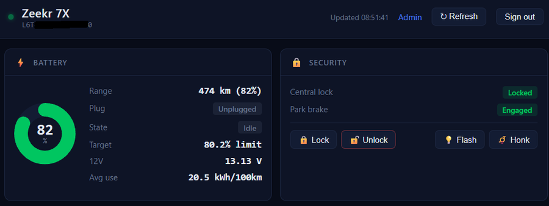
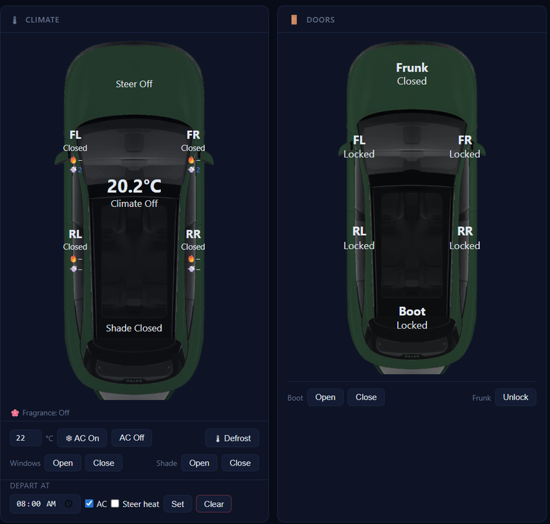
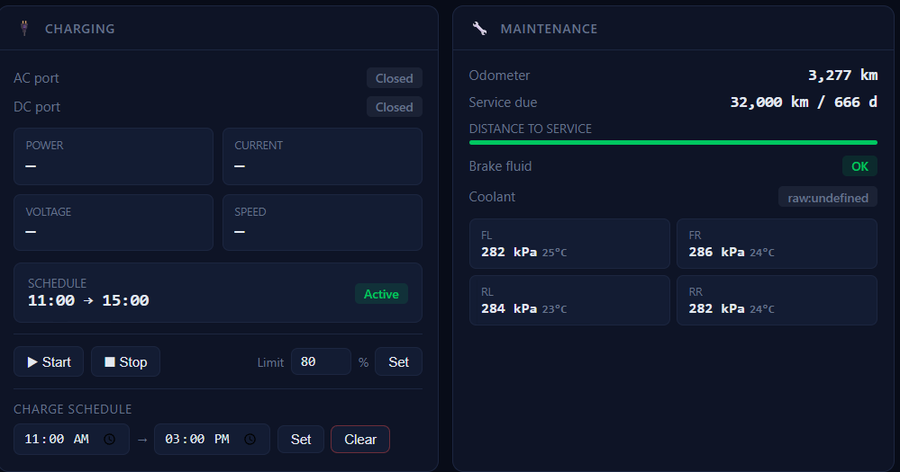

# zeekr-dash

A self-hosted web dashboard for Zeekr EVs. Displays real-time vehicle status and provides remote controls — lock/unlock, climate, charging, windows, and more — from any browser on your local network.





## Features

**Status**
- Battery level, range, charge power/current/voltage
- Door and window open/closed state with diagram
- Tyre pressures, odometer, service intervals
- Climate status (AC, defrost, steering wheel heat)
- Live vehicle location on map

**Remote controls**
- Lock / Unlock
- Flash lights / Honk horn
- AC on/off with temperature, Defrost, Steering wheel heat
- Windows and sunshade open/close
- Charge start/stop, charge limit, charge schedule
- Depart At (pre-condition before departure)
- Boot open/close, Frunk unlock
- Parking Comfort off, Live Detection off

**Other**
- EV charger coverage map (`/map`)
- Trip log with distance, energy, speed
- Multi-user login with admin panel
- API token auth for scripts/Home Assistant

---

## How it works

The Zeekr app signs API requests using secrets embedded in the Android APK (HMAC keys, an RSA public key for password encryption, and an AES key/IV for VIN encryption). This project uses a companion tool —  [`wysie/zeekr_key_extractor`](https://github.com/wysie/zeekr_key_extractor) — to extract those secrets from the APK automatically, without needing to reverse-engineer anything manually.

Once you have the secrets, the [`zeekr_ev_api`](https://github.com/Fryyyyy/zeekr_ev_api) library handles authentication and API calls. This project wraps it in a Flask server with a single-page dashboard UI.

---

## Prerequisites

- Python 3.10+
- A Zeekr account with a vehicle linked
- The Zeekr Android app APK (pulled from your phone or an emulator)
- An Android device or ADB set up (for pulling the APK)

> **Tip:** Create a separate Zeekr account and share your car with it. Using a dedicated account avoids session conflicts with the phone app.

---

## Installation

### 1. Clone the repository

```bash
git clone https://github.com/billsegall/zeekr-dash.git
cd zeekr-dash
git submodule update --init
```

### 2. Create a Python virtual environment

```bash
python3 -m venv .venv
source .venv/bin/activate
pip install -r requirements.txt
pip install -e zeekr_ev_api
```

### 3. Extract API secrets from the APK

Pull the Zeekr APK from your Android device (USB debugging must be enabled):

```bash
# Find the APK paths
adb shell pm path com.zeekr.global

# Pull base APK and ARM64 native library split
adb pull <path_to_base.apk> zeekr_base.apk
adb pull <path_to_arm64_v8a.apk> zeekr_arm64.apk
```

For EU market devices, substitute `com.zeekr.overseas` for `com.zeekr.global`.

Run the extractor:

```bash
cd zeekr_key_extractor
pip install -r requirements.txt
python zeekr_extract_secrets.py ../zeekr_base.apk ../zeekr_arm64.apk
cp zeekr_secrets.json ..
cd ..
```

For EU, add `--region EU`. See the [`zeekr_key_extractor` README](https://github.com/wysie/zeekr_key_extractor) for details on regions and troubleshooting.

This produces `zeekr_secrets.json` in the project root with the 6 required API secrets.

### 4. Configure credentials

Create a `.env` file:

```ini
ZEEKR_EMAIL=your@email.com
ZEEKR_PASSWORD=your_zeekr_password
ZEEKR_COUNTRY_CODE=AU
FLASK_SECRET_KEY=generate_a_random_string_here
API_TOKEN=optional_token_for_script_access
```

`ZEEKR_COUNTRY_CODE` is the two-letter country code for your account (e.g. `AU`, `NL`, `SG`).

`FLASK_SECRET_KEY` must be a stable random string — generate one with:

```bash
python3 -c "import secrets; print(secrets.token_hex(32))"
```

`API_TOKEN` is optional. If set, requests can authenticate with `?token=<value>` or `Authorization: Bearer <value>` instead of logging in. Useful for scripts and Home Assistant.

### 5. Establish a session

```bash
python connect.py
```

This logs in to the Zeekr API and saves a session token to `.session.json`. The server reuses this session on startup and re-authenticates automatically when it expires.

### 6. Set up dashboard users

Edit `users.json` to create your dashboard users. Each user needs a bcrypt/scrypt password hash, generated with:

```python
from werkzeug.security import generate_password_hash
print(generate_password_hash("your_password"))
```

Example `users.json`:

```json
{
  "users": [
    {
      "id": "unique_hex_id",
      "email": "you@example.com",
      "password_hash": "<hash from generate_password_hash>",
      "is_admin": true,
      "can_write": true
    }
  ]
}
```

`is_admin` — can access the admin panel and manage users.  
`can_write` — can use remote controls. Read-only users see live status but all control buttons are hidden.

You can also manage users through the admin panel at `/admin` once the server is running.

---

## Running

### Direct

```bash
source .venv/bin/activate
python server.py
```

The dashboard is served at `http://0.0.0.0:8889`.

### systemd (recommended for always-on use)

Create `/etc/systemd/system/zeekr-dash.service`:

```ini
[Unit]
Description=Zeekr 7X dashboard
After=network.target

[Service]
User=your_username
WorkingDirectory=/path/to/zeekr-dash
ExecStart=/path/to/zeekr-dash/.venv/bin/python /path/to/zeekr-dash/server.py
Restart=always
RestartSec=5
EnvironmentFile=/path/to/zeekr-dash/.env

[Install]
WantedBy=multi-user.target
```

Then:

```bash
sudo systemctl daemon-reload
sudo systemctl enable zeekr-dash
sudo systemctl start zeekr-dash
```

---

## API endpoints

All data endpoints require authentication (session cookie or API token).

| Method | Path | Description |
|---|---|---|
| `GET` | `/api/me` | Current session user info |
| `GET` | `/api/all` | Full vehicle snapshot (status, charging, modes, travel) |
| `GET` | `/api/status` | Raw vehicle status |
| `GET` | `/api/charging` | Charging status, limit, and schedule |
| `GET` | `/api/modes` | Remote control state (AC, modes, etc.) |
| `GET` | `/api/trips` | Journey log (`?size=20&days=30`) |
| `POST` | `/api/control` | Remote control action (requires `can_write`) |
| `POST` | `/api/refresh` | Force re-login to Zeekr API (requires admin) |
| `GET` | `/api/admin/users` | List users (requires admin) |
| `POST` | `/api/admin/users` | Create user (requires admin) |
| `PUT` | `/api/admin/users/<id>` | Update user (requires admin) |
| `DELETE` | `/api/admin/users/<id>` | Delete user (requires admin) |

### Control actions

POST `/api/control` with `{"action": "<name>", ...}`:

| Action | Parameters | Description |
|---|---|---|
| `lock` | — | Lock all doors |
| `unlock` | — | Unlock all doors |
| `flash` | — | Flash lights |
| `honk` | — | Honk and flash |
| `climate` | `on`, `temp` (16–30), `duration` (1–15 min) | AC on/off |
| `defrost_on` / `defrost_off` | — | Front defrost |
| `steer_heat_on` / `steer_heat_off` | — | Steering wheel heat |
| `windows_open` / `windows_close` | — | All windows |
| `sunshade_open` / `sunshade_close` | — | Sunshade |
| `charge_start` / `charge_stop` | — | Start/stop charging |
| `charge_limit` | `limit` (50–100, rounds to 5%) | Set charge limit |
| `charge_plan` | `cmd`, `start_time`, `end_time` | Scheduled charging |
| `travel_plan` | `cmd`, `scheduled_time`, `ac`, `sw` | Depart At plan |
| `boot_open` | — | Tailgate open |
| `boot_close` | — | Tailgate close |
| `frunk_unlock` | — | Frunk latch release |
| `charge_lid_ac_open` / `charge_lid_ac_close` | — | AC charge port lid |
| `charge_lid_dc_open` / `charge_lid_dc_close` | — | DC charge port lid |
| `parking_comfort_off` | — | Disable parking comfort mode |
| `live_detection_off` | — | Disable live detection |

---

## Admin panel

Navigate to `/admin` (admin users only).

- View all dashboard users
- Add new users with email, password, and permission flags
- Edit passwords and toggle `is_admin` / `can_write` per user
- Delete users (cannot delete yourself or the last admin)

---

## Known limitations

**Tailgate close:** `frunk_unlock` and `boot_open` are confirmed working. `boot_close` updated to use `RDL_2` (was incorrectly `RDL`) — serviceID confirmed via APK decompilation.

**Mode toggles (read-only):** Eight modes show current state but have no off button because the correct serviceIDs are unknown: GPS Tracking, Journey Logging, Camp Mode, Overheat Guard, Car Wash Mode, Panic Alarm, Visitor Mode, Privacy Mode.

---

## Acknowledgements

- [wysie](https://github.com/wysie) for [`zeekr_key_extractor`](https://github.com/wysie/zeekr_key_extractor)
- [Fryyyyy](https://github.com/Fryyyyy) for [`zeekr_homeassistant`](https://github.com/Fryyyyy/zeekr_homeassistant) and [`zeekr_ev_api`](https://github.com/Fryyyyy/zeekr_ev_api)
- [Capstone](https://www.capstone-engine.org/) and [pyelftools](https://github.com/eliben/pyelftools) used by the key extractor

## Disclaimer

This project is not affiliated with or endorsed by Zeekr or Geely. Use at your own risk. Reverse engineering the APK may be subject to legal restrictions in your jurisdiction.
